# 30diasDeCSS 👩🏻‍💻

 30 dias de CSS3, é um desafio que visa ajudá-lo a melhorar suas habilidades de codificação fazendo mini projetos diários utilizando HTML5 e CSS3

# Regras gerais

* Realizar 30 projetos, (para mim, não necessariamente por 30 dias seguidos)
* Compartilhe seu progresso nas mídias sociais (Twitter, Facebook, Linkedin etc.) usando a hashtag #30diasDeCSS
* O projeto deve ser concluído até 23:59

Gostou da ideia? 
[Clique aqui](https://github.com/MilenaCarecho/30diasDeCSS/issues/1) para participar

* [Dia 01 - Ícones de redes sociais em camadas](#day01)
* [Dia 02 - Loading animado](#day02)
* [Dia 03 - Efeito banner com mudança de cor do texto](#day03)
* [Dia 04 - Botão com borda animada](#day04)
* [Dia 05 - Botão com efeito pulse](#day05)
* [Dia 06 - Texto com efeito líquido](#day06)
* [Dia 07 - Ícone para menu hamburguer](#day07)
* [Dia 08 - Relógio utilizando neomorfismo](#day08)
* [Dia 09 - Menu bubble](#day09)
* [Dia 10 - Pêndulo de Newton](#day10)
* [Dia 11 - Botão com efeito hover](#day11)
* [Dia 12 - Sistema solar](#day12)
* [Dia 13 - Botão On/Off](#day13)
* [Dia 14 - Indicador de chat](#day14)
* [Dia 15 - Loading animado](#day15)
* [Dia 16 - Checkbox animado](#day16)
* [Dia 17 - Polaroid](#day17)

##  Desafio dia 01 - Ícones de redes sociais em camadas 
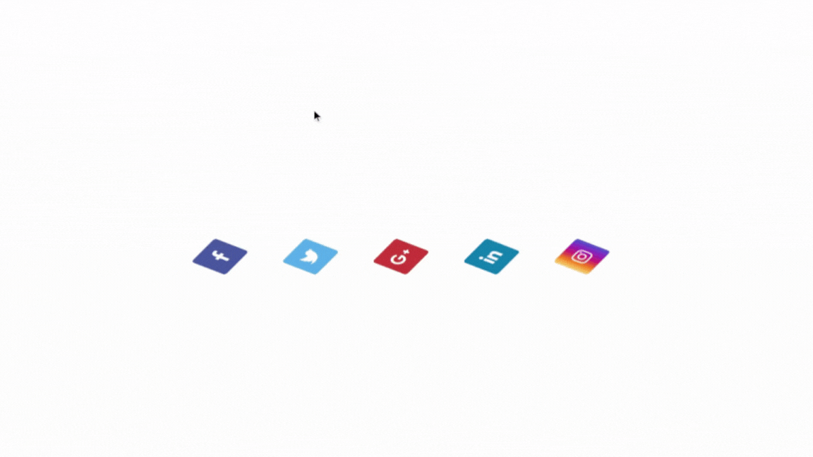
## Desafio dia 02 - Loading animado  

## Desafio dia 03 - Efeito banner com mudança de cor do texto 

## Desafio dia 04 - Botão com borda animada 

## Desafio dia 05 - Botão com efeito pulse 
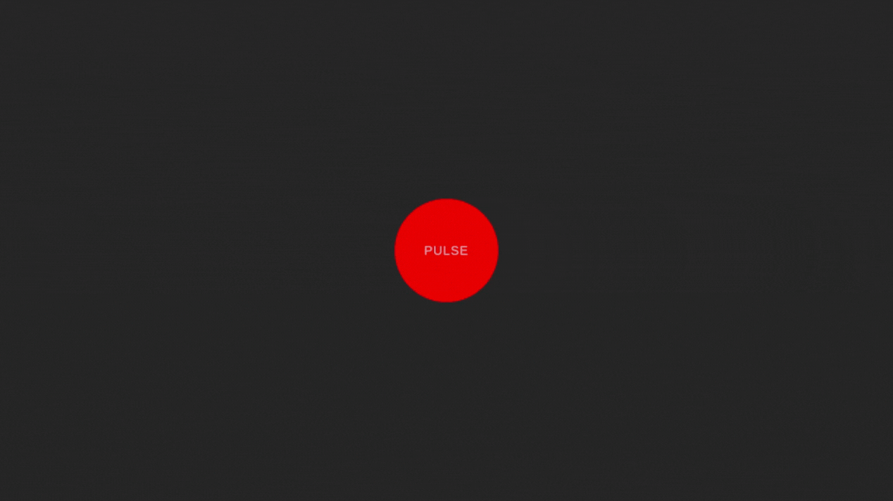
## Desafio dia 06 - Texto com efeito líquido 
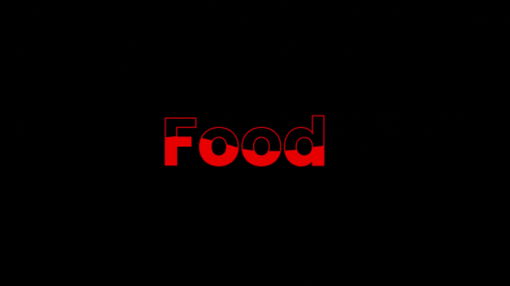
## Desafio dia 07 - Ícone para menu hamburguer 
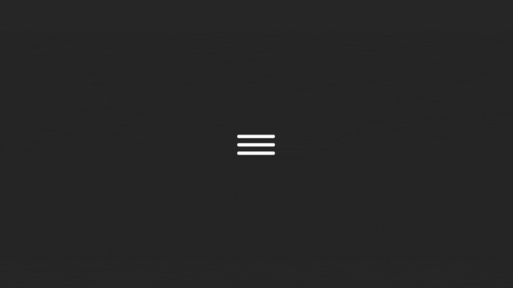
## Desafio dia 08 - Relógio utilizando neomorfismo 
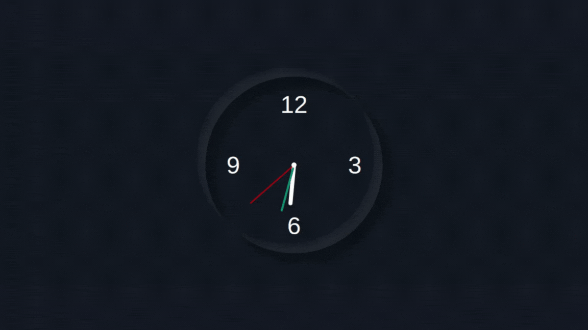
## Desafio dia 09 - Menu bubble 

## Desafio dia 10 - Pêndulo de Newton 
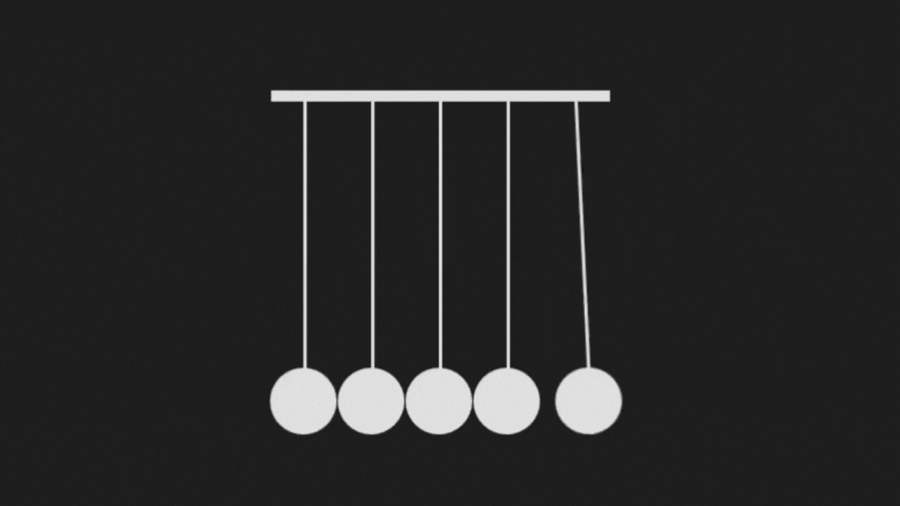
## Desafio dia 11 - Botão com efeito hover 
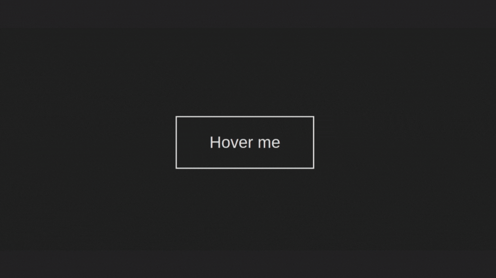
## Desafio dia 12 - Sistema solar 
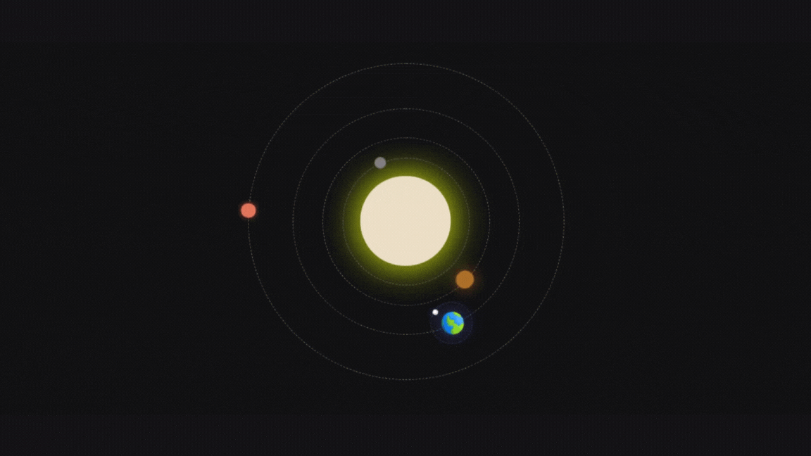
## Desafio dia 13 - Botão On/Off 
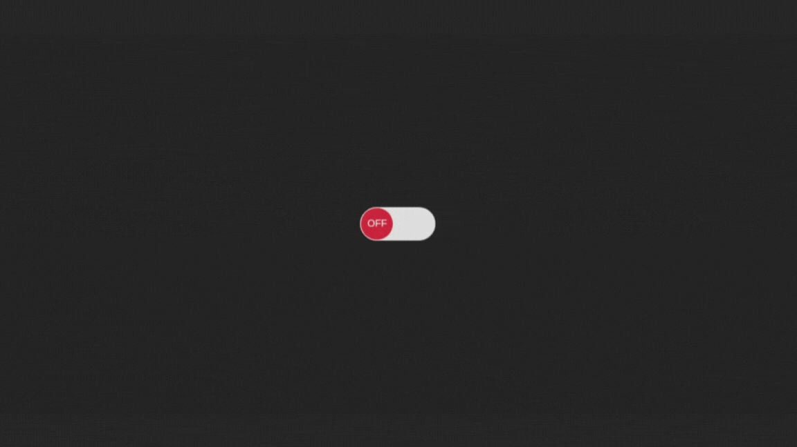
## Desafio dia 14 - Indicador de chat (digitando...) 
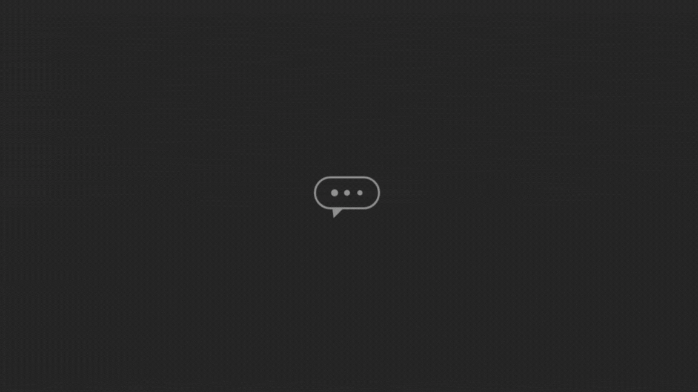
## Desafio dia 15 - Loading animado 
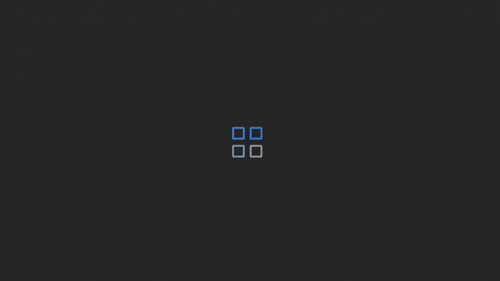
## Desafio dia 16 - Checkbox animado 
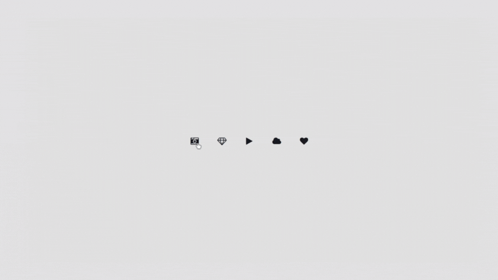
## Desafio dia 17 - Polaroid 
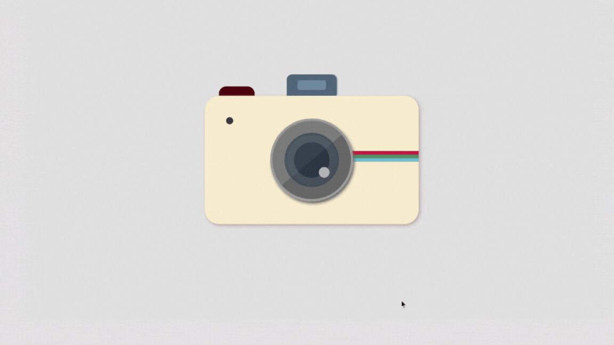

