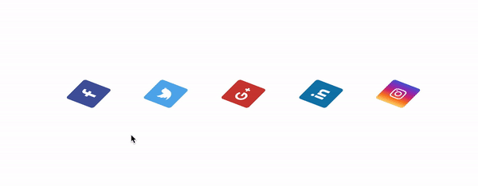
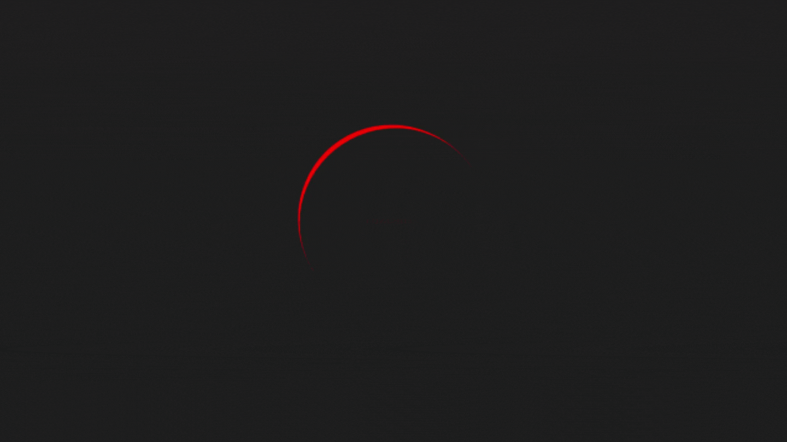
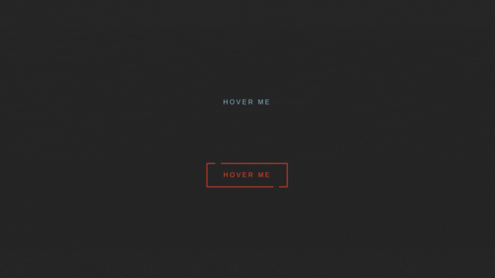

# 30diasDeCSS 👩🏻‍💻

 30 dias de CSS3, é um desafio que visa ajudá-lo a melhorar suas habilidades de codificação fazendo mini projetos diários utilizando HTML5 e CSS3

# Regras gerais

* Realizar 30 projetos, (para mim, não necessariamente por 30 dias seguidos)
* Compartilhe seu progresso nas mídias sociais (Twitter, Facebook, Linkedin etc.) usando a hashtag #30diasDeCSS
* O projeto deve ser concluído até 23:59

Gostou da ideia? 
[Clique aqui](https://github.com/MilenaCarecho/30diasDeCSS/issues/1) para participar

* [Dia 01 - Ícones de redes sociais em camadas](#day01)
* [Dia 02 - Loading animado](#day02)
* [Dia 03 - Efeito banner com mudança de cor do texto](#day03)
* [Dia 04 - Efeito banner com mudança de cor do texto](#day04)

##  Desafio dia 01 - Ícones de redes sociais em camadas 

## Desafio dia 02 - Loading animado  

## Desafio dia 03 - Efeito banner com mudança de cor do texto 

## Desafio dia 04 - Botão com borda animada 

